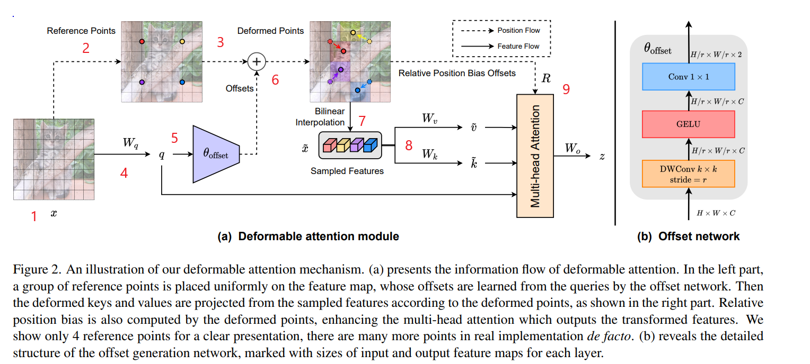

# DEFORMABLE ATTENTION MODULE

### Overview
The advantage of using Transformer for image processing like ViT is its wide receptive field. By suppressing a wider area than CNN, etc., it is possible to obtain better feature values. On the other hand, ViT, which is simply a repurposed Transformer, is also called Dense Transformer, and has the major disadvantage of increased memory requirements, high computational cost, delayed learning convergence and dangers of overlearning. since the relationship of all images is obtained, the calculation cost is enormous, and there is no inductive bias such as close pixels having a deep relationship, and it can surpass CNN only by learning with a large amount of data. There is a problem that accuracy cannot be achieved. Another problem is that irrelevant locations can affect the features.

Therefore, the SwinTransformer were created as improvements to ViT. **These are models that improve memory efficiency and computational efficiency by paying attention to areas in the image that have been narrowed down to some extent**. Compared to ViT, performance and improved, but on the other hand since the area in the image is narrowed down, it is possible that the extensive relationship information obtained from the original area is lost.

Swin does not calculate Self-Attention for the entire image, but divides the image into small regions and performs Self-Attention within the small regions. Compared to ViT, Swin has improved accuracy in ImageNet-1k, but it can only acquire relationships within a small area and may lose information on global relationships. In the receptive field of self-attention determined manually like Swin, important information may be missed.

However, an Attention range constructed manually, such as the Swin Transformer, may not be optimized in terms of efficiency. It is also possible that important Key/Value relationships were dropped while unnecessary ones were used. Ideally, the Attention range should be freely transformable for each input image, while allowing only important regions to be used.

### Deformable Attention module

&nbsp;

The input image  $x (H W C)$, with reference points $Hg * Wg = \frac{H*W}{r^2}$, where $r$ is manually determined, is processed as follows where $Hg = \frac{H}{r}$ and $Wg = \frac{W}{r}$:
1. The input is a feature map $x$ with dimension $H*W*C$
    &nbsp;
2. We select pixels $p$ as reference points from a uniform grid of dimensions $Hg$ × $Wg$ × 2 (where where $Hg = \frac{H}{r}$ and $Wg = \frac{W}{r}$, effectively downsampling the original grid).
    &nbsp;
3. These reference points are linearly projected onto a two-dimensional coordinate system with points ranging from $(0,0)$ to $(𝐻g - 1, 𝑊g - 1)$, and normalized between $[-1, +1]$, where the top-left corresponds to $(-1,-1)$.
    &nbsp;
4. To acquire an offset from each reference point, the feature map is linearly projected, resulting in the query token $𝑞 = 𝑥𝑊𝑞$.
5. The query token $𝑞$ is then passed into the subnetwork $\theta$ offset to generate the offset.
    $$
    \Delta p = \theta_{offset}(q)
    $$
and in order to ensure a stable learning process, a predefined value $s$ is employed to prevent $\Delta p$ from becoming too large, via the transformation $\Delta p \leftarrow s \: tanh(\Delta p)$
    &nbsp;
6. The deformed reference points are obtained by combining the reference point and the offset information.
    &nbsp;
7. We then conduct a bilinear interpolation on these deformed reference points, sampling the feature $\tilde{x}$.
    $$
    \tilde{x} = \phi(x; p + \Delta p) \qquad \phi(z; \: (p_x, p_y)) = \sum_{r_x, r_y}g(p_x, r_x)g(p_y, r_y)z[r_y,r_x,:]
    $$
   
8. A linear projection is carried out on the result from step 7 to secure the key token $\tilde{k} = \tilde{x}\odot 𝑊𝑘$ and the value token $\tilde{v} = \tilde{x} \odot Wv$.
    &nbsp;
9.  Finally, attention is applied in a way that integrates position embedding-like information, culminating in the final output.

### Offset network in brief (subnetwork)
In this subnetwork, the offset value is calculated for each reference point using a query. since the input image $x$ undergoes a linear transformation to obtain the query $(q)$, which is then inputted into the offset network. a subnet with two convolution modules with nonlinear activation functions is implemented.

First a $k \times k$ (5 × 5 in the paper) depthwise convolution is used to acquire local features. Then the offset network utilizes the $GeLU$ function between two convolutions. The convolution’s kernel in the **DW convolution** convolves spatial information.

Then a $1 \times 1$ **convolution** that convolves in the channel direction compresses to 2 channels (horizontal, vertical). The feature map stores the vertical and horizontal distance values corresponding to each reference point.

### Keys and Values
Translate the reference point using the values ​​determined by the offset network. Determine the value of the reference point to which it is moved by **bilinear interpolation** (to deal with floating numbers). Feature map using reference point determined values $x（Hg \times Wg \times C)$ and create $x$ Then linearly transform from to key and value.

In order to encourage diversity in the Deformed Points, the feature channel is split into G groups, a strategy reminiscent of the Multi-Head Self-Attention (MHSA) technique. Feature subsets within each group exploit a shared subnetwork to produce correlated offsets. Practically, the Multi-Head Attention units’ count is made G times the number of offset groups, ensuring that every transformed group of key and value tokens is assigned multiple Attention Heads.

Additionally, the relative position bias (between 7 and 9) encapsulates the relative position between all possible query-key pairs, enhancing the conventional Attention mechanism with spatial data.

Thus, multi-head attention applies, where the input query, key, and value are derived via:

$$
    q = xW_q \qquad \tilde{k} = \tilde{x}W_k \qquad \tilde{v} = \tilde{x}W_v
$$

Self-attention applies the following equation, where B indicates Deformable relative position bias:

$$
    z_{(m)} = Softmax(q^{(m)} \tilde{k}^{(m)^T} / \sqrt{d} + \phi (\tilde{B}, R))\tilde{v}^{(m)}
$$

Deformable multi-head atten-tion (DMHA) has similar computational costs, such as PVT and Swin Transformer. The difference is the computational complexity of the offset network.
