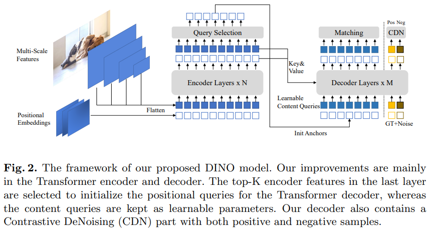
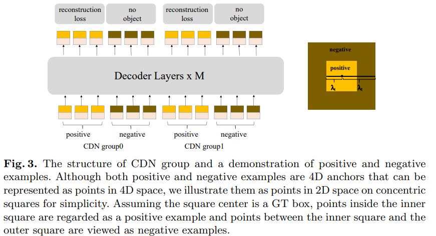
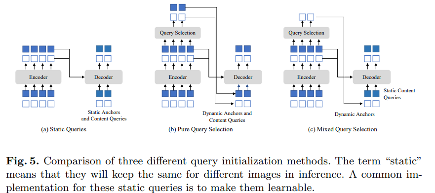
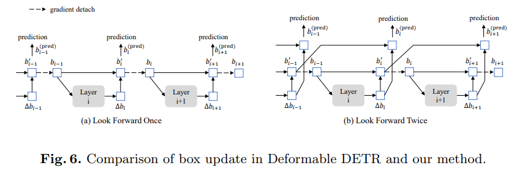

# DINO: DETR with Improved DeNoising Anchor Boxes for End-to-End Object Detection
**DETR** $\rightarrow$  **Deformable-DETR** $\rightarrow$ **DAB-DETR** $\rightarrow$ **DINO**

## Motivation

DETR ([Carion et al., 2020](https://arxiv.org/pdf/2005.12872)) is a novel Transformer-based detection algorithm that eliminated the need for hand-designed components and achieved incredible performance. DERT models object detection as a set of prediction task and assign labels by bipartite graph matching. It leverages learnable queries to investigate the existence of objects and combine features from an image feature map. However, the training convergence is slow and many times the meaning of queries is unclear.
To address those problems there are the following configurations of the DERT model:

- **DAB-DETR**([Lui,Li et al., 2022](https://arxiv.org/pdf/2201.12329)) proposes to formulate DETR queries as dynamic anchor boxes (DAB), which bridges the gap between classical anchor-based detectors and DERT-like ones. DAB-DETR explicitly formulates each positinal query in DETR as a 4D anchor box (w,h,x,y), where x, y are the center coordinates of the box and w, h correspond to its width and height. Such an explicit anchor box formulation makes its easy to dynamically refine anchor boxes layer by layer in the decoder.
- **DN-DETR**([Li,Zhang, et at 2022](https://openaccess.thecvf.com/content/CVPR2022/papers/Li_DN-DETR_Accelerate_DETR_Training_by_Introducing_Query_DeNoising_CVPR_2022_paper.pdf)) further solves the instability of bipartite matching by introducing the DN technique. The **denoising training (DN) method** help to accelerate the training convergence of DETR-like models. **It show that the slow convergence problem in DETR is caused by the instability of bipartite matching**. To mitigate this problem, DN-DETR proposes to additionally feed noised ground-truth (GT) labels and boxes into the Transformer decoder and train the model to reconstruct the ground-truth ones.
$\bullet$ The added noise ($\Delta x, \Delta y, \Delta w, \Delta h$) is constrained by ($|\Delta x| < \frac{\lambda w}{2}, |\Delta y| < \frac{\lambda h}{2}$), ($|\Delta w| < \lambda w, |\Delta h| < \lambda h $) where (x,y,w,h) denotes a GT box and $\lambda$ is a hyper-parameter to control the scale of noise. Since DN-DETR follows DAB-DETR to view decoder queries as anchors, a noised GT box can be viewed as as special anchor with a GT box nearby as $\lambda$ is usually small. In addition to the orginal DETR queries, **DN-DETR adds a DN part which feeds noised GT labels and boxes into the decoder to provide an auxiliary DN loss**. The DN loss effectively stabilizes and speeds up the DETR training and can be plugged into any DETR-like models.

The combination of DAB and DN makes DETR-like models competitive with classical detectors on both training efficiency and inference performance. Nowadays, the best detection models are based on improved classical detectors like DyHead (Dai et al., 2021) and HTC (Chen et al., 2019), for example, Swin V2 was trained with the HTC++ framework. Two main reasons contribute to the phenomenon:

- **Previous DETR-like models are inferior to the improved classical detectors**. Most classical detectors have been well studied and highly optimized, leading to a better performance compared with the newly developed DETR-like models. For instance, the best performing DETR-like models nowadays are still under 50 AP on COCO.
- **The scalability of DETR-like models has not been well studied**. There is no reported result about how DETR-like
  models perform when scaling to a large backbone and a large-scale data set.

Specifically, by improving the denoising training, query initialization, and box prediction, authors design a new DETR-like model based on DN-DETR, DAB-DETR, and Deformable DETR, and named **DINO**(**D**ETR with **I**mproved de**N**oising anch**O**r box). DINO demonstrates a great scalability, setting a new record of 63.3 AP on the COCO test-dev leaderboard.

---

## Overview

As a DETR-like model, DINO contains:

- a backbone
- a multi-layer Transformer encoder layer
- a multi-layer Transformer decoder layer
- multiple prediction heads
- Following DAB-DETR, authors formulate queries in decoder as dynamic anchor boxes and refine them step-by-step across decoder layers.
- Following DN-DETR, authors add ground truth labels and boxes with noises into the Transformer decoder layers to help stabilize bipartite matching during training.
  &nbsp;

Authors also adopt **deformable attention** for its computational efficiency. Moreover, authors propose three new methods as follows:

1. To improve the one-to-one matching, **authors propose a contrastive denoising training** by adding both positive and negative samples of the same ground truth at the same time. After adding two different noises to the same ground truth box, authors mark the box with a smaller noise as positive and the other as negative. **The contrastive denoising training** helps the model to avoid duplicate outputs of the same target.
   &nbsp;

2. The dynamic anchor box formulation of queries links DETR-like models with classical two-stage models. Hence **authors propose a mixed query selection method**, which helps better initialize the queries. authors select initial anchor boxes as positional queries from the output of the encoder, similar to. However, authors leave the content queries learnable as before, encouraging the first decoder layer to focus on the spatial prior.
   &nbsp;

3. To leverage the refined box information from later layers to help optimize the parameters of their adjacent early layers, **authors propose a new look forward twice** scheme to correct the updated parameters with gradients from later layers.
   &nbsp;

---

## Model Overview

Following DAB-DETR and DN-DETR, DINO formulates the positional queries as dynamic anchor boxes and is trained with an extra DN loss. Note that DNDETR also adopts several techniques from Deformable DETR to achieve a better performance, including its deformable attention mechanism and “look forward once" implementation in layer parameter update. DINO further adopts the query selection idea from Deformable DETR to better initialize the positional queries. Built upon this strong baseline, _DINO introduces three novel methods to further improve the detection performance_.

As a DETR-like model, DINO is an end-to-end architecture. The overall pipeline is shown in bellow

- Given an image, authors extract multi-scale features with backbones like ResNet or Swin Transformer, and then feed them into the Transformer encoder with corresponding positional embeddings.
&nbsp;

- After **feature enhancement** with the encoder layers, **authors propose a new mixed query selection strategy to initialize anchors as positional queries for the decoder**. Note that this strategy does not initialize content queries but leaves them learnable. With the initialized anchors and the learnable content queries, authors use the deformable attention to combine the features of the encoder outputs and update the queries layer-by-layer. The final outputs are formed with refined anchor boxes and classification results predicted by refined content features.
  &nbsp;

- As in DN-DETR, authors have an extra DN branch to perform denoising training. Beyond the standard DN method, authors propose a new contrastive denoising training approach by taking into account hard negative samples.
  &nbsp;

- To fully leverage the refined box information from later layers to help optimize the parameters of their adjacent early layer, a novel look forward twice method is proposed to pass gradients between adjacent layers.

---

#### Contrastive Denoising Training

The DN-DETR is very effective in stabilizing training and accelerating convergence by using DN queries is making predictions based on anchors which have GT boxes nearby. Nonetheless, it cannot predict “no object” for anchors with no object nearby. Hence, **Contrastive DeNoising Training (CDN)** is proposed to address this problem.

Previously, DN-DETR has a hyper-parameter $\lambda$ to control the noise scale, and the generated noises are no larger than that as DN-DETR wants the model to reconstruct the ground truth (GT) from moderately noised queries. In our method, authors have two hyper-parameters $\lambda_1$ and $\lambda_2$, where $\lambda_1$ < $\lambda_2$. As shown in the concentric squares in Fig. 3, authors generate two types of CDN queries: **positive queries** and **negative queries**.

- **positive queries** within the **inner square** have **a noise scale smaller than** $\lambda_1$ and are expected to reconstruct their corresponding ground truth boxes.
  &nbsp;
- **Negative queries**  **between the inner and outer squares** have **a noise scale larger than** λ1 and smaller than λ2. Those are expected to predict “no object” for the anchors with no object nearby. Also, they are using small $\lambda_2$ because the hard negative samples close to GT boxes are most helpful to improve the performance.

As shown in Fig. 3, each CDN group has a set of positive queries and negative queries. If an image has $n$ GT boxes, a CDN group will have $2 × n$ queries with each GT box generating a positive and a negative queries. In their approach, they are using multiple CDN groups to improve the effectiveness of their method. Each group has a set of positive queries and negative queries.

The reconstruction losses are $l_1$ and $GIOU$ losses for box regression and _focal loss_ for classification. The loss to classify negative samples as background is also focal loss.
Finally, to measure the effectiveness of this method they defined the **Average Top-K Distance (ATD(k))** by evaluating how far anchors are from their target GT boxes in the matching part. As in DETR, each anchor corresponds to a prediction which may be matched with a GT box or background. authors only consider those matched with GT boxes here. Assume having $N$ GT bounding boxes in validation sets:

$$
b_0,b_1,b_2,...,b_{N-1}
$$

where $b_i$ = ($x_i$, $y_i$, $w_i$, $h_i$)

For each $b_i$, authors can find its corresponding anchor and denote it as
$$a_i = (x{'}_i, y{'}_i, w{'}_i, h{'}_i)$$
where $a_i$ i is the initial anchor box of the decoder whose refined box after the last decoder layer is assigned to $b_i$ during matching. Then fomular:

$$
ATD(k) = \frac{1}{k} \sum \{topK(\{\|b_0 - a_0\|_1, \|b_1 - a_1\|_1,...,\|b_{N-1} - a_{N-1}\|_1\}, k)\}
$$

where

- $\|b_0 - a_0\|_1$ is the $l_1$ distance between $b_i$ and $a_1$
- $topK($ **x** $, k)$ is a function that returns the set of $k$ largest elements in **x**.

---

#### Mixed Query Selection

1. **DETR, DN-DETR** decoder queries are static embeddings without taking any encoder features from an individual image. They learn anchors or positional queries  from training data directly and set the content queries as all 0 vectors. 
&nbsp;
2. **Deformable DETR** **learns both the positional and content queries**, which is another implementation of static query initialization. To further improve the performance, **Deformable DETR has a query variant (called "two-stage"), which select top K encoder features from the last encoder layer as priors to enhance decoder queries. Both the positional and content queries are generated by a linear tranform of the selected features**. The selected feautures are fed to an auxiliary detection head to get predicted boxes, which are used to initialize reference boxes.
&nbsp;
3. The dynamic 4D anchor box formulation of queries in our model makes it closely related to decoder positional queries, which can be improved by query selection. **We follow the above practice and propose a mixed query selection approach. we only initialize anchor boxes using the position information associated with the selected top-K features, but leave the content queries static as before**. Note that Deformable DETR utilizes the top-K features to enhance both the positional queries and the content queries. As the selected features are preliminary content features without further refinement, they could be ambiguous and misleading to the decoder. For example, a selected feature may contain multiple objects or be only part of an object. In contrast, our mixed query selection approach only enhances the positional queries with top-K selected features and keeps the content queries learnable as before. It helps the model to use better positional information to pool more comprehensive content features from the encoder.

---

#### Look Forward Twice

The iterative box refinement in Deformable-DETR blocks gradient back propagation to stabilize training. We name the method look forward once since the parameters of layer $i$ are updated based on the auxiliary loss of boxes $b_i$ only **(Fig.6 a)**. However, we conjecture that the improved box information from a later layer could be more helpful to correct the box prediction in its adjacent early layer.

**We propose another way called look forward twice to perform box update**, where the parameters of layer-$i$ are influenced by losses of both layer-$i$ and layer-($i$ + 1). For each predicted offset $\Delta b_i$, it will be used to update box twice, one for $b'_i$ and another for $b^{pred}_{i+1}$, hence we name our method as look forward twice.

The final precision of a predicted box $b^{pred}_i$ is determind by two factors: 
  - the quality of the initial box $b_{i-1}$
  - the predicted offset of the box $\Delta b_i$

The look forward once scheme optimizes the latter only, as the gradient information is detached from layer-$i$ to layer-($i$ − 1). In contrast, we improve both the initial
box $b_{i−1}$ and the predicted box offset $\Delta b_i$. A simple way to improving the quality is supervising the final box $b'_i$ of layer $i$ with the output of the next layer $\Delta b_{i+1}$. Hence we sum of the $b'_i$ and $\Delta b_{i+1}$ as the predicted box of layer-($i$ + 1).

More specifically, given an input box $b_{i-1}$ for the $i$-th layer, we obtain the final prediction box $b^{pred}_i$ by:

$$
\Delta b_i=Layer_i(b_{i-1}), \qquad b'_i = Update(b_{i-1}, \Delta b_i)
$$

$$
b_i = Detach(b'_i), \qquad b^{pred}_i = Update(b'_{i-1}, \Delta b_i)
$$

where $b'_i$ is the undeteached version of $b_i$. The term Update($.$ , $.$) is a function that refines box $b_{i-1}$ by the predicted box offset $\Delta b_i$. We adopt the same way for box update as in Deformable DETR.